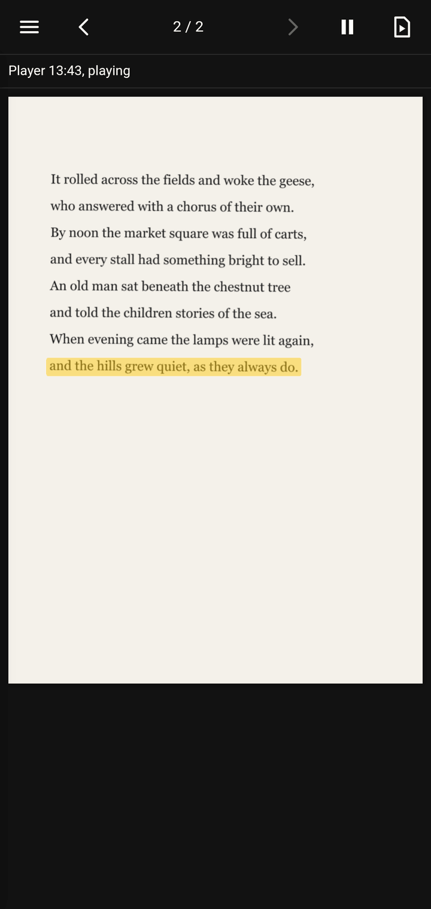
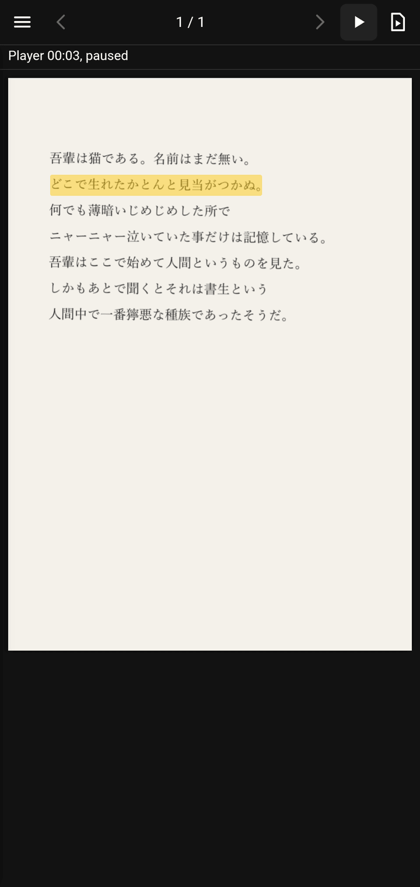
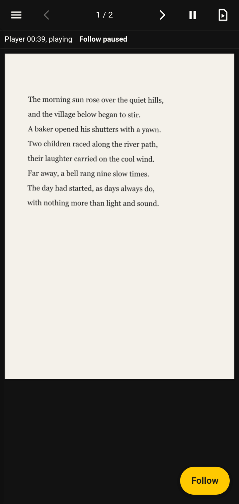
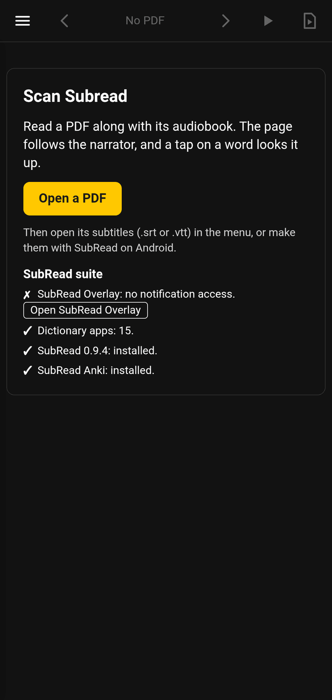

# Scan Subread

A PDF reader that follows the audiobook. It works with scans and with
text PDFs, in a browser and as an Android app, and it is a member of the
SubRead suite:

- [SubRead Overlay](https://github.com/equwal/subread-overlay) reads the
  position of the audiobook player and gives it to this app. Install it
  and allow notification access.
- [SubRead Dictionary](https://github.com/equwal/subread-dictionary), or
  any app in the text selection menu (Takoboto, AnkiDroid, a translator),
  looks the words up.
- [SubRead](https://github.com/equwal/subread-android) makes the subtitle
  file (`.srt`) from the audiobook and the text of the book.
- [SubRead Anki](https://github.com/equwal/subread-anki) makes an Anki
  card from a word and its sentence.

You load a PDF and the `.srt` of its audiobook. The app reads the text
of each page, aligns each subtitle cue to it, and follows the player: it
marks the line that the narrator reads and turns the page. Tap a word,
and the text from that word to the end of the line goes to the
dictionary of your choice. Press a word for half a second, and SubRead
Anki makes a card. The player pauses while the dictionary or the card
is open.

<p>
  
  
  
  
</p>

## Install

On Android, download `Scan-SubRead-<version>.apk` from the
[latest release](https://github.com/equwal/scan-subread/releases/latest)
and open it. The release APKs have the signature of the SubRead suite. A
debug build from your own PC has a different signature: uninstall it
first. This deletes the pages and the books that the app keeps.

In a browser, build and serve the web app (see "Run").

## How to use it

1. Press "Open a PDF" on the start card, or open the menu (the `☰`
   button on a phone; the left panel on a desktop) and load a PDF there.
   The app reads the pages at once: the current page first, then the
   pages after it to the end, then the pages before it. The status strip
   shows how far it is.
2. In the menu, load the subtitles, or on Android press "Make subtitles
   with SubRead": pick the audiobook. SubRead starts when all pages are
   read ("Reading pages N/M first..."), and makes the `.srt` from the
   audio and the text of the book. The result loads at once, is kept for
   this PDF, and can be shared as a file.
3. Start the player. The status strip shows its position. The page
   follows.

On a phone the menu is a drawer over the page. A tap outside the drawer
only closes it. The drawer also closes after you choose a file or a cue.

The subtitles field takes each file, because a browser download of an
`.srt` often has the type `application/octet-stream`. A file with no
subtitle lines, for example a PDF, keeps the subtitles that are loaded.
The app reads a subtitle file in UTF-8, UTF-16 or Shift_JIS. A PDF that
does not open keeps the book that is open. A file of 0 bytes, for
example a file that another app still writes, gives "The file is empty
or not ready."

### The book is kept

The app keeps a copy of the last book, its page, its subtitles and its
"Force OCR" setting in IndexedDB. At start it opens the last book at
its page, with its subtitles, without a picker. Android stops the
reader while you are in the dictionary or in the player app, and the
reader comes back where you were. When the copy cannot be read, for
example after the app storage was cleared, the app forgets it and shows
the start card.

Subtitles belong to a book. Another book opens with its own subtitles,
or with none. Subtitles that you load while no book is open are for the
book that you open next. The page goes to the meta data of the book one
second after it changes.

The first start after an upgrade from a build with the old dictionary
can take long: the upgrade deletes about 86 MB of dictionary data. The
strip then says "Updating the page cache...", and the start card shows.

### Android: Back, the screen and the suite

- Back closes the page jump, else the drawer, else puts the reader in
  the background. It never closes the reader, so the reader keeps its
  state.
- The screen stays on while a book is open, the player plays and the
  follow is not off. In the background the app does not read the
  player.
- The start card and the menu show the SubRead suite: SubRead Overlay
  (with its notification access), the dictionary apps, SubRead and
  SubRead Anki, each with a link to its releases when it is missing.
  "Open SubRead Overlay" opens the overlay, so that you can give it
  notification access.
- SubRead can finish while Android has stopped the reader. SubRead
  0.10.0 and later write the `.srt` into a result file of the book, and
  the reader loads it when the book opens or the app comes back.
- Before the subtitles of SubRead load, the app asks when they replace
  a file that you loaded, when SubRead found another language than the
  one of the book, and when it found less than 80% of the lines.

### The status strip

The strip under the top bar shows three things:

- The player: its time, and "playing" or "paused". When there is a
  problem, it says what to do, for example "Allow notification access in
  SubRead Overlay." with an "Open SubRead Overlay" button. Play and
  "move the audio to this page" are off while the player cannot work.
  "Follow paused" shows while a page turn by hand holds the follow.
- The reading of the pages, for example "Reading 3/40 · page 5: OCR 45%".
  It goes away when all pages are read. A page that cannot be read does
  not stop the others: at the end the strip says "2 pages could not be
  read." with Retry, which reads only those pages. When OCR cannot
  start, for example with no network on the first run, the strip says
  so, with Retry. "Force OCR is on" shows while it is on for the book.
- The last event, for example a lookup or an error. It fades after 6
  seconds. Screen readers read this part.

### The three follow modes

- **Highlight and turn pages**: the line of the current cue is marked on
  the page, and the page turns when the cue is on another page. When the
  mark goes out of view, the page scrolls so that the mark is in the
  upper third. It does not scroll in the 3 seconds after you scroll.
- **Turn pages only**: the page turns, no mark. Use this when the
  alignment is not good enough for a mark, for example with a noisy scan.
- **Off**: the page does not move. The status strip and the cue list
  still show where the player is.

A cue that the alignment did not find in the book has no page. In the
two follow modes the page then follows the nearest matched cue before it,
up to five cues back. A cue at a page break has text on two pages. The
page turns inside that cue: the first page shows for the share of the
text of the cue on it, then the next page.

When you turn a page yourself (an arrow, a key, a swipe or the page
jump), the follow holds: the page does not turn by itself, and a
"Follow" button shows over the lower right corner of the page. It is not
in the top bar, so the buttons there do not move. The mark still shows
when the cue of now is on the page that you look at. The hold ends when
you press "Follow", when the audio reaches the page that you look at,
when you move the audio from the app (the cue list or "move the audio
to this page"), or when the player jumps. A new alignment after a page
is read does not end the hold.

### The top bar

From the left: the menu, the previous page, the page label, the next
page, play or pause, and "move the audio to this page". The last one
moves the player to where the text of the page starts, the same as "Move
the audio to this page" in the KOReader plugin. When that text starts in
a cue from the page before, the audio goes into the cue, at the share of
the text on the page before. The button is off while no subtitles are
loaded, and while the player has no position or reports a problem.

Other ways to turn pages:

- The keys ArrowRight, ArrowLeft, PageDown and PageUp.
- A swipe to the left or to the right on the page. A page that you
  zoomed in on does not turn: the swipe moves the page.
- The page label: press it, type a page number, and press Enter. Escape
  or a tap outside cancels.

The setting "Pages turn right to left (vertical Japanese)" makes
ArrowLeft, a swipe to the right and the left arrow go to the next page.
It is on for the OCR language "Japanese, vertical" until you set it.

### Text layer or OCR

The app reads the text layer of a page first. When the page has fewer
than 10 characters of text, it is a scan: the app renders the page and
runs OCR (tesseract.js) in the language of the "OCR language" setting.
"Force OCR" skips the text layer, for a PDF whose text layer is wrong.
It is a setting of the book: another book opens with its own setting.
The status strip says which one was used for each page. A new setting
stops the OCR of the reading before at once.

The app renders a scanned page to a canvas 1600 pixels wide. tesseract.js
gets the pixels of the canvas as a PPM image: a short text header and the
RGB bytes. The app does not give it the canvas itself. With a canvas,
tesseract.js first makes a PNG file, and on a test phone (Android
WebView) that took about 13 s for each page. The PPM image takes
milliseconds and has the same pixels, so OCR gives the same tokens.

The OCR of a page can take 2 minutes, and more for a page of more than 4
million pixels. When it takes longer, or when the OCR worker fails, the
app stops the worker and counts the page as not read. The next page
starts a new worker, so one bad page does not stop the reading.

Both give the same tokens: one box per character with a line id and a
word id. The alignment, the mark, the page turn and the lookup work the
same way on a scan and on a text PDF.

The tokens of each page are kept in IndexedDB, under the file name, the
file size, the page, the OCR language and the source. A book that was
read once aligns at once the next time. "Clear this book's pages" and
"Clear all pages" remove them, after a question.

### Lookups

A tap sends the text from the tapped word to the end of its line (at
most 40 characters) to the dictionary. A tap may land up to about 24
CSS pixels from a character, the size of a finger. In Latin script the
text starts at the first letter of the tapped word. In Japanese and
Chinese it starts at the tapped character, because a dictionary app
scans from there. Punctuation at the start is skipped, and a tap on
punctuation only sends nothing. When the line ends within 4 characters
and does not end a sentence, the next line of the page follows, so a
word that wraps is whole. A tap on a page that is not read yet tells
how many pages are read.

"Dictionary" lists every app in the text selection menu; "Ask each
time" shows the Android chooser. "Pause on lookup" pauses the player
before the dictionary opens and starts it again when the dictionary
closes. When the player cannot pause, the lookup still runs.

On the web there is no dictionary app: the tap copies the text to the
clipboard, and the strip shows "Copied" or "Copy failed" with the text.
The web does not pause the audio, and it has no "Dictionary" and no
"Pause on lookup" setting.

### Anki cards

Press a word for half a second, without a move of more than 10 CSS
pixels: SubRead Anki shows a card. A move turns the long press into a
swipe or a scroll, and the click after a long press does no lookup.

- The sentence is the text of the marked cue when the word is in it,
  else the sentence around the word on its page.
- For a Japanese or Chinese word, the card gets the sentence only, and
  you tap the word in SubRead Anki: OCR does not show where such a word
  ends. For another word, the card also gets the word, without the
  punctuation at its edges.
- The source is the book name and the page, for example
  "sample-eng-2p, p. 1".
- "Pause on lookup" pauses the player while the card shows.

The strip says "Card added to Anki." when the card is in Anki. The web
says "Anki cards need SubRead Anki on Android."

### The web

The browser has no SubRead Overlay. The "Audio (web only)" field plays
the audio in the page, and the page follows that clock. Everything else
is the same. The web build is for development and for a desktop reader.

## Run

```bash
npm install
```

```bash
npm run dev
```

Open the URL that Vite prints. Try the fixtures in `fixtures/`:
`sample-eng-2p.pdf` (a two-page scan) or `sample-eng-2p-text.pdf` (the
same text as a text layer) with `sample-eng-2p.srt` and `silence.wav`.
One cue of that file crosses from page 1 to page 2. `sample-jpn.pdf`
and `sample-jpn-text.pdf` go with `sample-jpn.srt` and the "Japanese,
horizontal" OCR language.

The app serves the tesseract.js worker and its WebAssembly core from its
own files. The first OCR run of a language downloads the language data
from jsDelivr. The browser keeps the language data in IndexedDB after
that.

## Check

```bash
npm run typecheck
```

```bash
npm test
```

```bash
npm run test:e2e
```

```bash
npm run build
```

```bash
npm run format:check
```

`npm test` runs the unit and property tests. They need no browser and no
network. `npm run test:e2e` runs real OCR on the fixture images in Node
and checks that every cue is marked on the correct line and page, and
reads the text-layer PDFs with pdf.js in Node and checks that the text
layer gives every character in order. It also checks that OCR reads the
same symbols from a PPM image of a page as from its PNG file. It needs
network on the first run to fetch language data into `.tessdata/`.

`npm run fixtures` rebuilds the fixtures from `fixtures/sample-text.ts`.
The Japanese text-layer PDF needs `C:\Windows\Fonts\yumin.ttf`; without
it, that one file is skipped.

## Android

Capacitor wraps the web build in an Android WebView. The app is the same
code. The native part is one plugin,
`android/app/src/main/java/com/equwal/scansubread/SubReadPlugin.java`,
the bridge to the suite:

- `playerState`, `play`, `pause`, `seek`: the content provider of SubRead
  Overlay, `content://space.subread.overlay.player/state` (the debug
  build of the overlay has the authority
  `space.subread.overlay.debug.player`; both are tried). The app reads
  the player every 2 seconds (every 5 seconds after an error) and
  computes the position between two reads from the reported position,
  the time of the report and the speed, the same as the overlay itself.
  A reported position more than 3 seconds from the expected one counts
  as a seek.
- `lookup`: `Intent.ACTION_PROCESS_TEXT` with the text. The call
  resolves when the dictionary closes.
- `dictionaries`, `setDictionary`: the apps that take that intent, and
  the chosen one.
- `makeSubtitles`, `pickAudio`, `pendingSubtitles`: the intent API of
  SubRead (`space.subread.app.action.ALIGN`). The book text goes to
  SubRead through a FileProvider. SubRead 0.10.0 and later also write
  the `.srt` into a result file of the book (`subread-<hash>.srt`), and
  `pendingSubtitles` reads it. When SubRead is not installed, the menu
  links to its releases.
- `ankiAdd`: `space.subread.anki.action.ADD`, a card in SubRead Anki
  (the release build, else the debug build).
- `suite`: which apps of the suite are installed. `openOverlay`: opens
  SubRead Overlay for its notification access.
- `keepAwake`: keeps the screen on.
- `shareText`: the share sheet, for the finished `.srt`. The file Uri is
  in the clip of the intent, so the preview of the chooser can read it.

The `@capacitor/app` plugin gives the Back button and the app state
(front or background).

`capacitor.config.ts` holds the app id, the app name and the web
directory. The `android/` project is the Capacitor template and is
committed.

Prerequisites:

- JDK 21 (`JAVA_HOME` set).
- Android SDK with platform 36 and build-tools 35 or newer.
- `ANDROID_HOME` set to the SDK path, or `android/local.properties`
  with `sdk.dir=C:\\Android\\Sdk` (the file is not committed).

Build the web app and copy it into the Android project:

```bash
npm run android:sync
```

Build the debug APK (the first run downloads Gradle and its dependencies):

```bash
npm run android:build
```

In PowerShell, set the SDK path first when `ANDROID_HOME` is not set:

```bash
$env:ANDROID_HOME = 'C:\Android\Sdk'; npm run android:build
```

If Gradle fails with `Unable to establish loopback connection`, the JDK
cannot open a Unix domain socket in the user temp directory. Point it to
a different directory for the build:

```bash
$env:JAVA_TOOL_OPTIONS = '-Djdk.net.unixdomain.tmpdir=C:\Windows\Temp'; $env:ANDROID_HOME = 'C:\Android\Sdk'; npm run android:build
```

The APK lands at `android/app/build/outputs/apk/debug/app-debug.apk`.
Install it on a connected phone with USB debugging on:

```bash
adb install -r android/app/build/outputs/apk/debug/app-debug.apk
```

Notes:

- The WebView serves the app from `https://localhost`. The file fields
  open the Android file chooser. Put your PDFs and `.srt` files in
  `Download` to find them fast.
- The first OCR run of a language needs network: tesseract.js fetches
  the language data from jsDelivr over HTTPS. The worker and the
  WebAssembly core are in the app. The `INTERNET` permission is in the
  manifest. No cleartext traffic setting is needed.
- The pdf.js worker is part of the bundle.
- Pinch zoom is on (`zoomEnabled` in `capacitor.config.ts`). The page
  fits the screen width in each orientation, up to 1000 CSS pixels, and
  it renders again at the resolution of the screen after a rotation, and
  at the zoom 0.3 s after a pinch zoom stops, so the text stays sharp.
  The canvas is at most 4096 pixels wide and 12 million pixels in area.
  Zoom in and scroll to read small print. On a zoomed page a swipe moves
  the page and does not turn it.
- The pages, the copy of the last book and the meta data of each book
  (page, subtitles, "Force OCR") live in the WebView's IndexedDB.
  Uninstalling the app deletes them.

## Dependencies

Runtime:

- `pdfjs-dist`: renders PDF pages to a canvas and reads the text layer.
- `tesseract.js`: OCR in a Web Worker. Returns a box for each symbol.
- `tesseract.js-core`: the WebAssembly core of tesseract.js. The app
  serves it from its own files, so OCR needs the network only for the
  language data.
- `fast-diff`: character-level Myers diff. The alignment is built on it.
- `idb`: a thin Promise wrapper around IndexedDB. It replaces the
  callback and event plumbing of the raw IndexedDB API.
- `@capacitor/core`, `@capacitor/android`: the Android shell and the
  plugin bridge.
- `@capacitor/app`: the Back button, the app state (front or
  background) and "move the app to the background".

Development:

- `vite`, `typescript`: build and strict type check.
- `vitest`, `fast-check`: unit tests and property tests.
- `fake-indexeddb`: IndexedDB in Node, for the tests of the page cache.
- `prettier`: formatting.
- `sharp`, `pdf-lib`, `@pdf-lib/fontkit`, `tsx`: build the synthetic
  fixtures (render text to a page image, wrap it in an image-only PDF,
  write the same text as a text-layer PDF, write a silent WAV).
  `@pdf-lib/fontkit` lets pdf-lib embed a TrueType font for the
  Japanese text-layer page. `sharp` also gives the e2e test the RGBA
  pixels of a page image, for the PPM image.

The SRT/VTT parser is written by hand (`src/subtitles.ts`). The `subtitle`
package imports the Node `stream` module at load time, so it does not run
in a browser bundle.

## Layout

- `src/player-state.ts`: pure parser of the state line of SubRead
  Overlay. A port of `player_state.lua` from the KOReader plugin.
- `src/play-clock.ts`: pure clock: the position now from a report of
  the player. A port of `PlayClock.kt` from SubRead Overlay.
- `src/follower.ts`: pure reducer: the cue of now and the page of the
  audio to a mark and a page turn, in the three follow modes, with the
  hold after a page turn by the user.
- `src/cue-pages.ts`: pure parts of each cue on the pages, the page of
  the audio at a time, and the time where the text of a page starts.
- `src/clock-source.ts`: the two time sources, the overlay (Android)
  and the audio element (web).
- `src/text-layer.ts`: pure conversion of pdf.js text items to tokens.
- `src/ocr-tokens.ts`: pure conversion of a tesseract result to tokens.
- `src/ppm.ts`: pure PPM image of the pixels of a page canvas, for
  tesseract.js.
- `src/align.ts`: pure alignment of subtitle cues to the page text.
- `src/subtitles.ts`: pure SRT/VTT parser and active-cue lookup.
- `src/hit-test.ts`: pure tap on the page. Hit test, scan string, the
  lookup text.
- `src/line-boxes.ts`: pure boxes that mark a cue, one for each text
  line of the page, grown to the edges of its words. The left and the
  right side get a quarter of the line height as padding, because OCR
  symbol boxes can end before the ink.
- `src/paging.ts`: pure page turns from keys, swipes and the arrows, the
  page jump, the reading direction, and the limits of the long press.
- `src/scroll.ts`: pure scroll position that brings the mark into view.
- `src/render-size.ts`: pure width of the canvas of a page, for the
  screen and the pinch zoom.
- `src/messages.ts`: pure texts of the status strip.
- `src/read-order.ts`: pure order in which the pages are read.
- `src/book-text.ts`: pure tokens to the book text for SubRead.
- `src/book-subtitles.ts`: pure rules for the subtitles of a book: the
  subtitles when a book opens, the result file name for SubRead, and the
  checks before a SubRead result loads.
- `src/sentence.ts`: pure sentence around a token.
- `src/anki-card.ts`: pure fields of an Anki card for a long press.
- `src/suite.ts`: pure checklist of the SubRead suite.
- `src/app-state.ts`: pure rules for the Back button and the screen.
- `src/subread.ts`: the typed side of the plugin, with the web fallback.
- `src/token-cache.ts`: IndexedDB store for the page tokens, the copy of
  the last book and the meta data of each book (thin).
- `src/ocr.ts`, `src/pdf.ts`: thin browser wrappers around the libraries.
  `src/ocr-job.ts`: the start error, the time limit of a page, the new
  worker after a failed page and the stop of OCR, without tesseract.js.
- `src/view.ts`: the page view: render to fit the width, draw the mark,
  scroll to it, render again on a resize.
- `src/nav.ts`: page turns by the user: the arrows, the keys, the swipe
  and the page jump, and the long press.
- `src/status.ts`: the status strip.
- `src/drawer.ts`: the menu, a drawer on a phone.
- `src/main.ts`: UI wiring: the book, the subtitles, the follow, SubRead
  and the app state.
- `test/`: unit and property tests. `test/e2e/`: OCR and text-layer
  end-to-end tests.
- `fixtures/`, `scripts/make-fixtures.ts`: synthetic scanned pages and
  text-layer PDFs.

## Scope limits

- The alignment finds each page in the subtitles on its own: runs of 8
  characters that occur only once in the subtitles show where the page
  is, and a character diff compares the page with that part only. So a
  cue matches only a page that is read, and subtitles of another text
  match nothing. A page is aligned once, when it is read. That takes a
  few milliseconds; all the pages of a book of 300 000 characters take
  about 1 s (Node on a desktop).
- A page with fewer than three such runs gets no cues, for example a
  page with only a few words. A subtitle file of 64 characters or less
  is too short for the runs: it is compared with each whole page, and
  text that is not in it can match by chance.
- A vertical font in a text layer (`dir: 'ttb'` in pdf.js) lays the
  characters down the page. This path has unit tests with mocked items,
  but no fixture PDF: pdf-lib does not write vertical text.
- One audio file for one book. A book in many audio files is not
  handled; SubRead has the same limit.
- No iOS build.

## Licence

AGPL-3.0. See `LICENSE`.
